#  DDOS-SimLab
 
<p align="center">
  
  
  
  


## Project Overview

DDOS-SimLab is a simplified lab environment designed to help understand and demonstrate how Distributed Denial of Service (DDoS) attacks work. A DDoS attack occurs when multiple systems send massive amounts of traffic or malicious requests to a target server, overwhelming its resources and making it unavailable to legitimate users.

In this lab, I focused on simulating two common DDoS attack techniques:

*HTTP Flood Attack*

This method sends a high volume of normal-looking HTTP requests (GET/POST) to overload the web server’s application layer. Since requests appear legitimate, they can be difficult to detect and mitigate.

*SYN Flood Attack*

A classic network-layer attack where an attacker sends many SYN requests to initiate TCP connections but never completes the handshake. This exhausts the server's connection queue, preventing it from handling real traffic.

This project allowed me to understand how these attacks are structured, executed, and detected, along with analyzing server behavior under stress

> Hands-on simulation of TCP SYN Flood and HTTP Flood attacks against an isolated lab target,
> paired with a multi-layer Python defence engine and an interactive real-time traffic dashboard
> built and tested on Kali Linux inside VirtualBox.
 
---
 
## Ethical Disclaimer
 
**This project was conducted strictly in an isolated VirtualBox lab environment.**

---

##  Lab Environment
 
| Machine | OS | IP Address | Role |
|---|---|---|---|
| Attacker | Kali Linux (VirtualBox) | `192.168.56.6` | Runs all attack & defence scripts |
| Target | Cisco Lab Linux VM (VirtualBox) | `192.168.56.8` | Victim — receives the simulated attacks |
 
Both machines were connected on a **VirtualBox Host-Only adapter** — completely isolated
from the internet. The target had no internet access at any point during testing.
 
---
 
##  Repository Structure
 
```
DDoS-SimLab/
├── README.md                    ← You are here
├── DISCLAIMER.md                ← Full ethical use statement
│
├── scripts/
│   ├── syn_flood.py             ← TCP SYN Flood simulator (Scapy-based)
│   ├── http_flood.py            ← HTTP Flood simulator (Layer-7)
│   ├── defense.py               ← Multi-layer defence engine
│   └── run_lab.py               ← Master orchestrator (runs all modules)
│
├── dashboard/
│   └── index.html               ← Interactive live traffic visualisation dashboard
│
├── logs/                        ← JSON simulation results (auto-generated on run)
│   ├── syn_results.json
│   ├── http_results.json
│   ├── defense_results.json
│   └── full_lab_report.json
│
├── report/
│   └── report.md     ← Full professional lab report
│
└── screenshots/                 ← Real lab evidence — terminal + dashboard captures
```
 
---
 
## What Each Script Does
 
### `syn_flood.py` — TCP SYN Flood
 
Simulates a **Layer 3/4 volumetric attack** using Scapy to craft and send raw TCP SYN
packets with randomised spoofed source IP addresses toward the target.
 
**How a SYN Flood works:**
**Every connection on the internet starts with a "handshake"** — your computer says *SYN*
(hello), the server replies *SYN-ACK* (hello back), and you reply *ACK* (got it, let's
talk). In a SYN flood, the attacker sends thousands of SYN hellos with fake return
addresses. The server keeps waiting for the final ACK that never comes, filling up its
connection table until it can't accept any real visitors.
 
**What the script does:**
- Uses Scapy to build proper TCP/IP packets from scratch
- Randomises the source IP on every packet (IP spoofing)
- Fires packets from multiple threads simultaneously
- Counts packets sent in real time with a live terminal counter
- Saves results to `logs/syn_results.json`
 
---
 
### `http_flood.py` — HTTP Flood
 
Simulates a **Layer 7 application-layer attack** by opening real TCP connections to the
target's web server and sending valid HTTP GET requests as fast as possible.
 
**How an HTTP Flood works:**
Unlike a SYN flood which works at the network level, an HTTP flood sends requests that
look exactly like normal website visitors. The server has to actually process each one —
loading pages, running code, reading files — which burns through its CPU and memory until
it can't serve real users anymore. Because the requests look legitimate, they are much
harder to detect and block.
 
**What the script does:**
- Opens real connections to port 80 on the target
- Sends valid HTTP/1.1 GET requests to random URL paths
- Rotates through 8 different User-Agent strings to mimic different browsers
- Adds fake `X-Forwarded-For` headers to obscure the source
- Tracks successful vs failed requests and saves to `logs/http_results.json`
 
---
 
### `defense.py` — Multi-Layer Defence Engine
 
Simulates how a real DDoS mitigation system works by running four defence techniques
simultaneously against incoming traffic.
 
**The four defence layers:**
 
1. **Token Bucket Rate Limiter** — Each IP gets a "bucket" of 100 tokens. Every request
   costs one token. Tokens refill at 20 per second. If your bucket is empty, your
   requests are dropped until it refills. This stops any single IP from sending too many
   requests in a burst.
 
2. **IP Reputation Engine** — Watches every IP address. If any IP sends more than 150
   requests within a 10-second window, it gets permanently blacklisted for the session.
   Once blacklisted, every request from that IP is instantly rejected with zero
   processing cost.
 
3. **SYN Cookie Simulator** — Demonstrates the RFC 4987 technique where the server
   encodes a secret cookie into its reply instead of storing half-open connection state.
   This means a SYN flood cannot exhaust the connection table because nothing is stored
   until the full handshake is verified.
 
4. **Anomaly Detector** — Monitors traffic rate against a rolling baseline. If traffic
   suddenly spikes to 2.5× the normal rate, an alert fires. The baseline automatically
   adapts over time using an exponential moving average so it stays accurate as traffic
   patterns change.
 
---
 
### `run_lab.py` — Orchestrator
 
A single entry point that runs all modules in sequence with a single command. Saves a
combined `full_lab_report.json` at the end covering all three phases.
 
---
 
##  Dashboard — `dashboard/index.html`
 
The dashboard is an interactive visual representation of the attack and defence simulation.
It runs entirely in your browser — no internet connection needed.
 
### How to open it
 
```
# Start a local server from inside the dashboard folder
cd ~/DDoS-SimLab/dashboard
python3 -m http.server 8080
 
# Then open Firefox and go to:
# http://localhost:8080
```
 
---
 
### What you are looking at — explained simply
 
Think of this like a **security control room screen** showing a live attack happening and
the defences responding to it in real time.
 
---
 
####  Live Traffic Flow Chart (top centre)

### Dashboard — SYN Flood Running
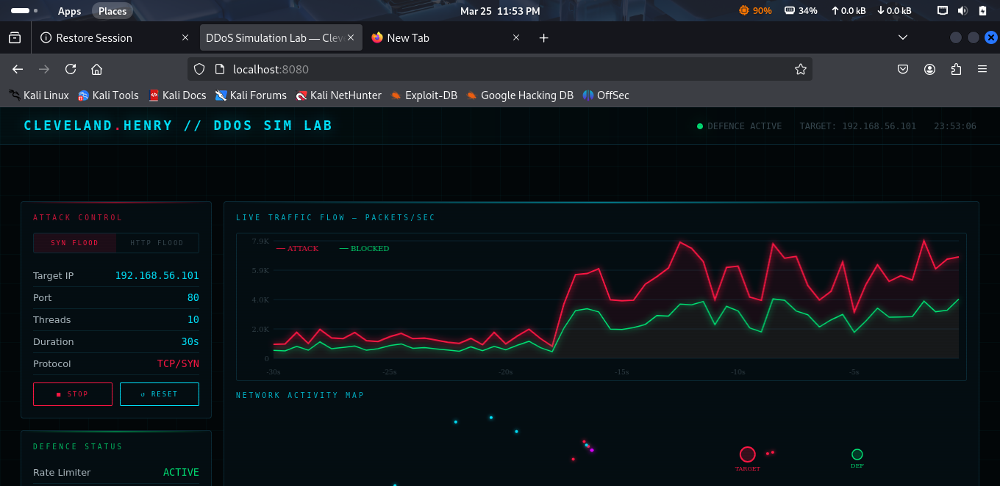
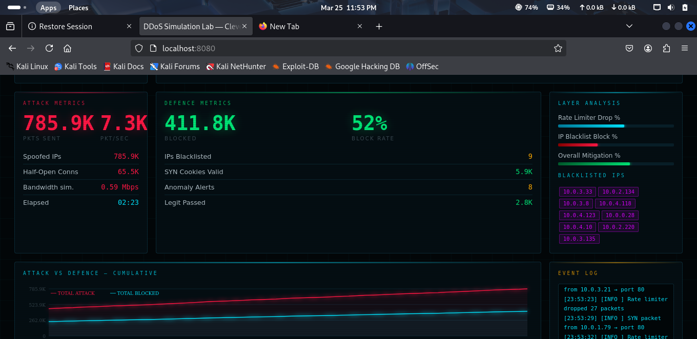
 
### Dashboard — HTTP Flood Running
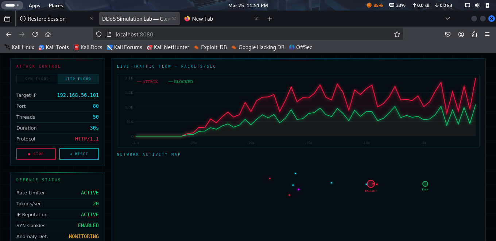
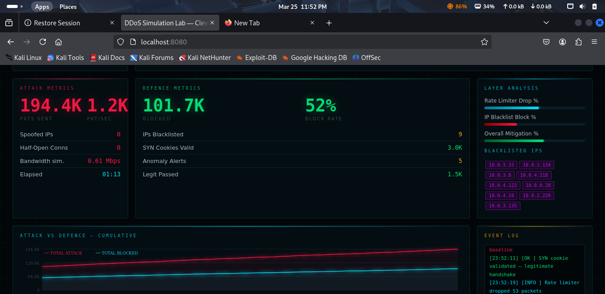
 
---

This is the main chart. It has two lines:
 
- **Red line (ATTACK)** — This shows how many attack packets per second are being fired
  at the target. It starts low and ramps up as the flood intensifies. The spiky shape is
  realistic — real DDoS attacks are never perfectly smooth.
 
- **Green line (BLOCKED)** — This shows how many of those attack packets the defence
  layer is catching and dropping before they reach the server. Ideally you want this line
  as close to the red line as possible — meaning almost everything is being blocked.
 
- **The gap between red and green** — This is what actually gets through to the server.
  The smaller this gap, the better the defence is performing.
 
---
 
#### Network Activity Map (below the main chart)
 
This is an animated diagram showing packets as moving dots travelling from left (attackers)
to right (the target server):
 
- **Red/cyan dots** — Individual attack packets flying toward the target
- **Purple dots** — Packets that have been intercepted by the defence layer before
  reaching the server
- **TARGET circle** — Your victim machine (192.168.56.8)
- **DEF circle** — The defence node intercepting traffic before it hits the target
 
---
 
####  Attack Metrics Panel (bottom left — red)
 
Shows the live statistics of the attack itself:
 
- **PKTS SENT** — Total number of attack packets sent so far in this session
- **PKT/SEC** — How many packets are being sent every second right now
- **Spoofed IPs** — How many fake source IP addresses have been used (SYN flood only)
- **Half-Open Conns** — How many incomplete TCP connections are piling up on the target
- **Bandwidth sim.** — Estimated bandwidth the attack is consuming in Mbps
- **Elapsed** — How long the simulation has been running (minutes:seconds)


 
---
 
####  Defence Metrics Panel (bottom centre — green)

 
 
Shows how the defence layer is responding:
 
- **BLOCKED** — Total packets blocked so far
- **BLOCK RATE** — Percentage of all attack traffic that has been successfully stopped
- **IPs Blacklisted** — How many attacker IPs have been automatically banned
- **SYN Cookies Valid** — How many legitimate connections passed the SYN cookie check
- **Anomaly Alerts** — How many times the anomaly detector fired a traffic spike warning
- **Legit Passed** — Simulated legitimate user requests that passed through unaffected
 
---
 
####  Layer Analysis Panel (right — progress bars)
 
Three progress bars showing which defence layer is doing the most work:
 
- **Rate Limiter Drop %** — Percentage of traffic dropped by the token bucket limiter
- **IP Blacklist Block %** — Percentage blocked because the source IP was already banned
- **Overall Mitigation %** — Combined total — what percentage of attack traffic never
  reached the server
 
Below this you can see the **Blacklisted IPs** — the actual IP addresses that were
automatically banned during the simulation, shown as purple tags.
 
---
 
####  Event Log Terminal (bottom right)


 
A scrolling log of everything happening in real time, colour coded:
 
- **Cyan [INFO]** — Normal events: packets received, rate limiter actions
- **Amber [WARN]** — Warnings: high request rates detected
- **Red [ALERT]** — Anomaly detected — traffic spike above baseline
- **Green [OK]** — Positive events: SYN cookie validated, legitimate handshake confirmed
- **Purple [BLOCK]** — An IP address has just been blacklisted
 
---
 
####  Attack vs Defence Cumulative Chart (bottom centre)
 
This chart shows the **running totals** since the simulation started rather than the
current rate:
 
- **Red line** — Total attack packets fired since launch
- **Cyan line** — Total packets blocked since launch
 
As time goes on the red line climbs steeply while the cyan line follows closely behind —
showing the defence keeping pace with the attack.
 
---
 
### The Buttons — what each one does


| Button | What it does |
|---|---|
| **SYN FLOOD** tab | Switches the simulation to show a TCP SYN flood — higher packet rates, spoofed IPs, half-open connections |
| **HTTP FLOOD** tab | Switches to an HTTP application-layer flood — lower packet rate but valid-looking web requests |
| **LAUNCH** | Starts the simulation — all charts begin animating and metrics start counting up |
| **STOP** | Pauses the simulation — charts freeze at their current values |
| **RESET** | Clears everything back to zero — wipes all counters, charts, logs, and blacklisted IPs |
| **TOGGLE** (Defence) | Turns the entire defence layer on or off. Turn it OFF and watch the block rate drop to 0% and the green line disappear — showing what happens with no protection in place |
 
---
 
##  How to Run the Lab
 
### Step 1 — Set up VirtualBox networking
 
Both VMs must be on a **Host-Only adapter** in VirtualBox:
- VirtualBox → File → Host Network Manager → Create adapter (`vboxnet0`, subnet `192.168.56.0/24`)
- Each VM: Settings → Network → Adapter → Host-Only Adapter → `vboxnet0`
 
### Step 2 — Install web server on target (Cisco Linux VM)
 
```
# On the Cisco Lab Linux VM
sudo apt update && sudo apt install apache2 -y

# Downloads and installs Apache — the web server software that acts as the victim in our HTTP flood. The -y flag automatically confirms the installation without asking.

sudo systemctl start apache2
```
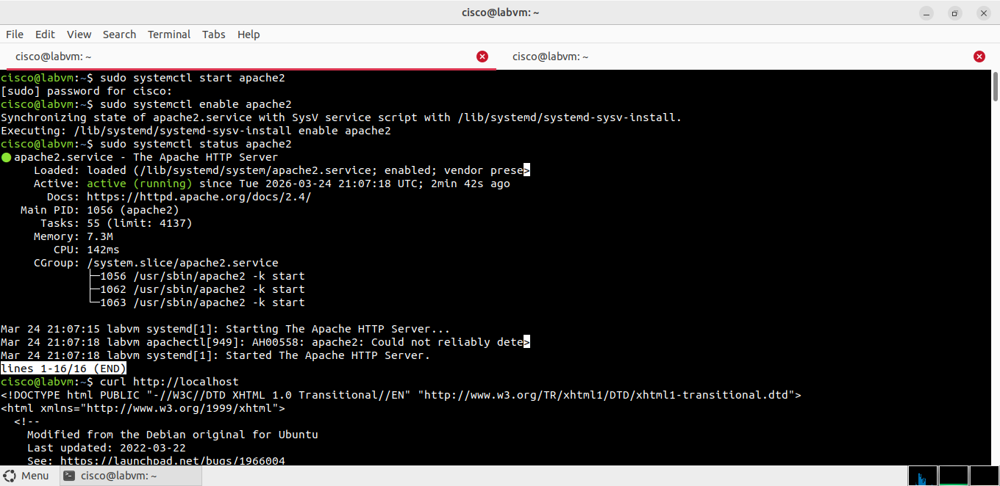

`start` *turns the web server on right now*.
`enable` *makes it start automatically every time the VM boots so you don't have to manually start it each session*.

`sudo systemctl status apache2` *Shows whether Apache is active and running. You want to see active (running) in green before proceeding*.

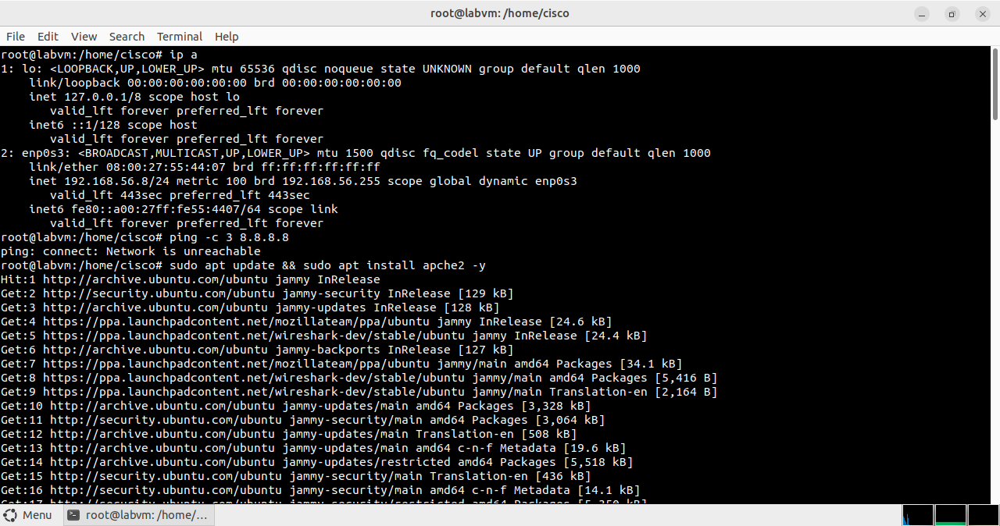

```
# Verify from Kali
nmap -sV 192.168.56.8 -p 80
# Expected: 80/tcp open http Apache httpd
```
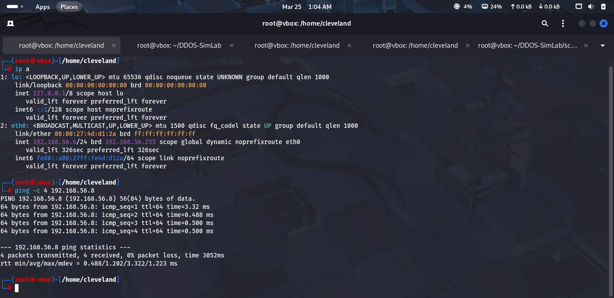

*Checks whether the web server on the target is actually running and listening. The `-sV` flag detects the version of the service. We needed to see 80/tcp open http before running the HTTP flood.*
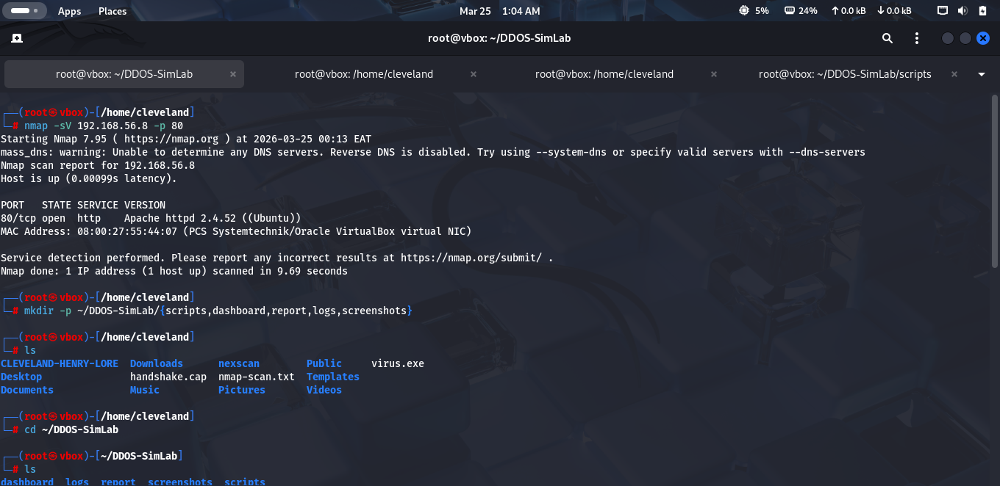

*All files in this project were created directly on Kali Linux using Nano — a simple terminal text editor. Here is exactly how each file was created.*

These are the 3 commands needed:

`nano filename.py` -> *Open/create a file*

`Ctrl + O` *then press* `Enter` -> *Save the file*

`Ctrl + X` -> *Exit nano*

`mkdir -p ~/DDoS-SimLab/{scripts,dashboard,report,logs,screenshots}` -> *Creates all project folders at once then moves the scripts folder where all python files will live.*

`cd ~/DDoS-SimLab/scripts` -> *moves to the created directory*

`nano syn_flood.py` -> *paste the full script then*:
- *press `Ctrl + O` to save -> Press `Enter` to confirm the filename*
- *press `Ctrl + X` to exit Nano*

- Do the same for all the other files we should create: `http_flood.py`, `defense.py`, `run_lab.py`, `dashboard/index.html`, `README.md`, `DISCLAIMER.md`

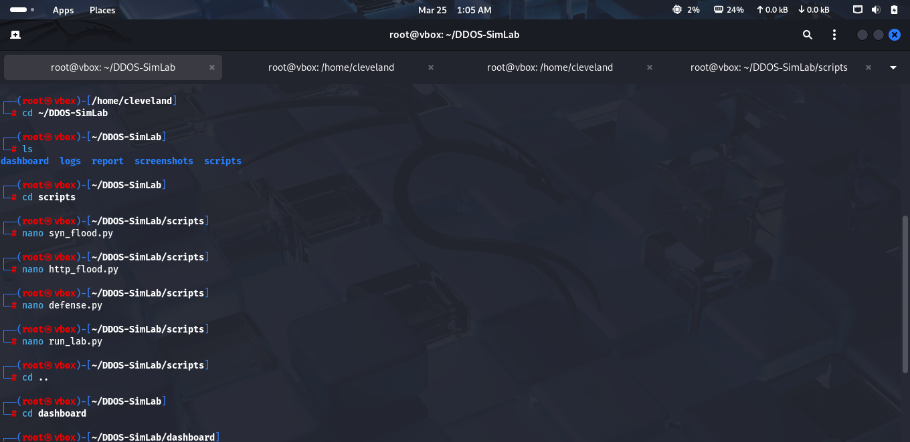

*You can preview the first few lines to make sure it saved properly* `head -6 syn_flood.py`

### Step 3 — Install Scapy on Kali

```
# Use apt — cleanest method on modern Kali
sudo apt install python3-scapy -y
 
# Verify
sudo python3 -c "from scapy.all import IP, TCP, send; print('Scapy ready')"
```
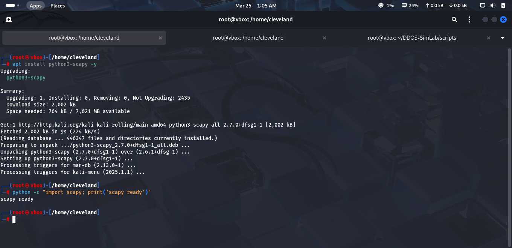

`sudo apt install python3-scapy -y` -> *Installs Scapy through Kali's own package manager instead of pip. This is the correct method on modern Kali Linux and worked perfectly.*
`sudo python3 -c "from scapy.all import IP, TCP, send; print('Scapy ready')"` -> *A quick one-line test that imports Scapy's core components. If it prints Scapy ready without errors, you're good to go.*

### Step 4 — Fix file permissions 

*After creating the files in DDOS-SimLab folder make them executable this will come handy in the future*:
```
# Fix permissions on the file
chmod 644 ~/DDoS-SimLab/dashboard/index.html
# means the owner can read and write, everyone else can only read

# Fix permissions on the folders too
chmod 755 ~/DDoS-SimLab/dashboard
chmod 755 ~/DDoS-SimLab
# means the folder is accessible to all users.
```
 
### Step 5 — Verify connectivity
 
```
# From Kali — must succeed
ping -c 3 192.168.56.8
 
# Confirm target port open
nmap 192.168.56.8 -p 80
```
 
### Step 6 — Start Wireshark (before running attacks)
 
```
sudo wireshark 
# Select your Host-Only interface (eth1 or vboxnet0)
# Start capture — leave it running throughout
```
 
### Step 7 — Run the SYN Flood
 
```
cd ~/DDoS-SimLab/scripts
sudo python3 syn_flood.py 192.168.56.8 -p 80 -d 30 -t 10
```
- `192.168.56.8` -> *the target IP(CISCO LAB VM)*
- `-p 80` -> *target port 80 (web server)*
- `-d 30` -> *run for 30 seconds*
- `-t 10` -> *use 10 threads simultaneously to maximise packet rate*
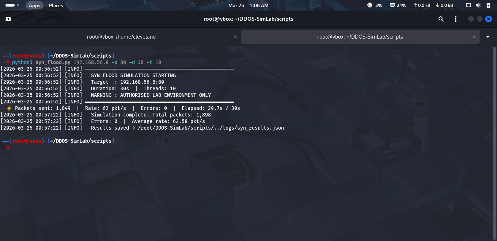

Wireshark filter to see only SYN packets:
```
tcp.flags.syn == 1 && tcp.flags.ack == 0
```
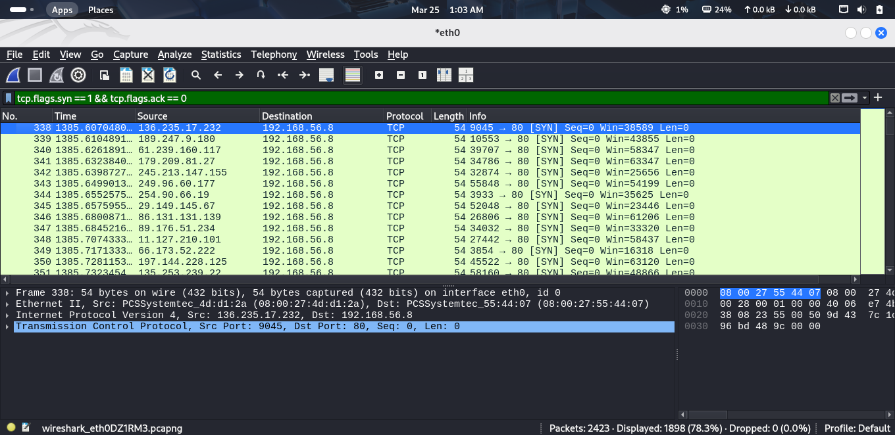

*Wireshark filtered to show only packets with the SYN flag set and ACK flag clear. Every packet arrived from a different randomised spoofed source IP, confirming IP spoofing was active throughout the simulation. In a legitimate connection you would always see a SYN followed by SYN-ACK followed by ACK — here thousands of SYN packets arrive with zero completed handshakes, which is the exact network signature of a SYN flood attack*

On the target VM, watch connections pile up:
on the terminal type `top` which shows:

- **CPU usage %** -> *how hard the processor is working*
- **Memory Usage** -> *how much RAM is being consumed*
- **Running processes** -> *every process on the system and how much resources each one is using*
- **Apache processes** -> *during the HTTP flood you could see the Apache worker processes (`apache2`) consuming increasingly more CPU*
  
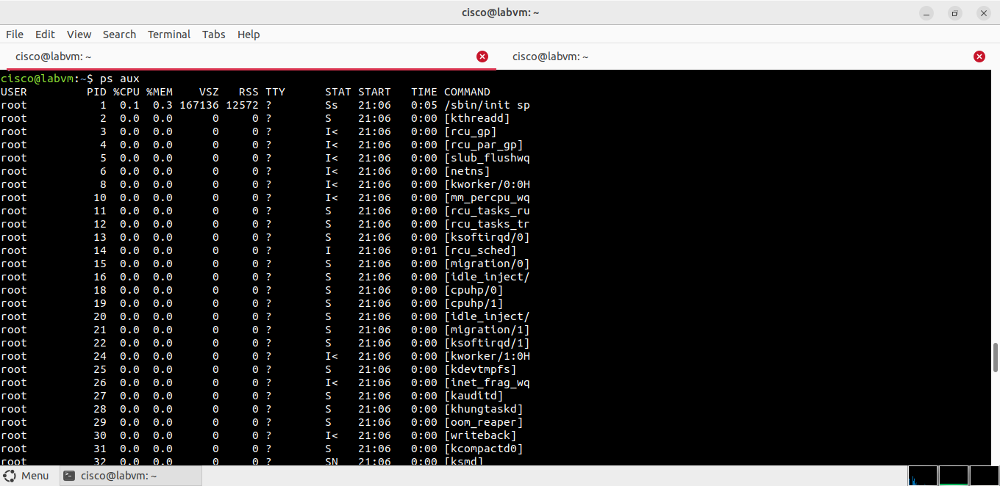

*Target CPU spiking under SYN flood — kernel overwhelmed processing thousands of half-open TCP connections per second.*

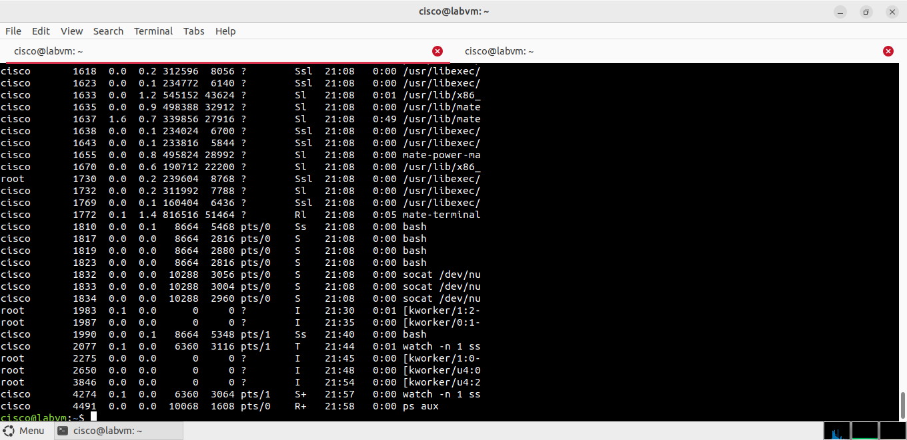

*Target CPU maxed out under HTTP flood — Apache exhausted processing hundreds of fake but valid-looking web requests per second.*

### Step 8 — Run the HTTP Flood
 
```
python3 http_flood.py 192.168.56.8 -p 80 -d 30 -t 50
```
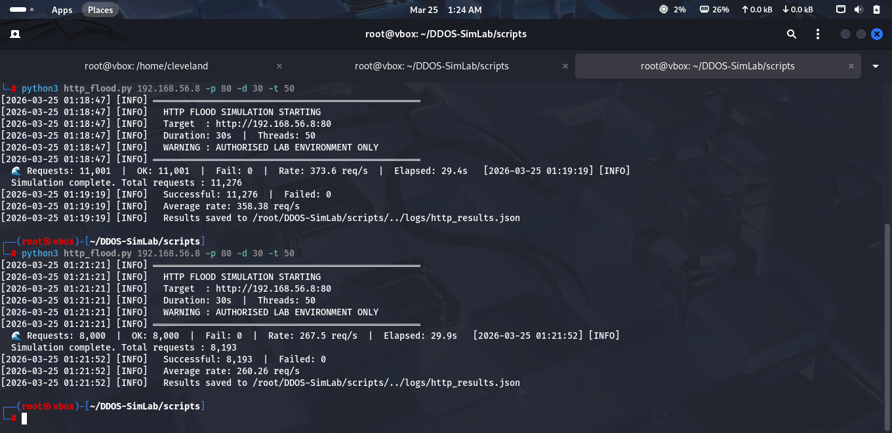

Watch Apache being hit on the target:

`sudo tail -f /var/log/apache2/access.log` -> *Shows Apache's access log in real time as new entries are written. During the HTTP flood you see hundreds of GET requests per second flooding the log — a clear visual that the attack is hitting the web server.*

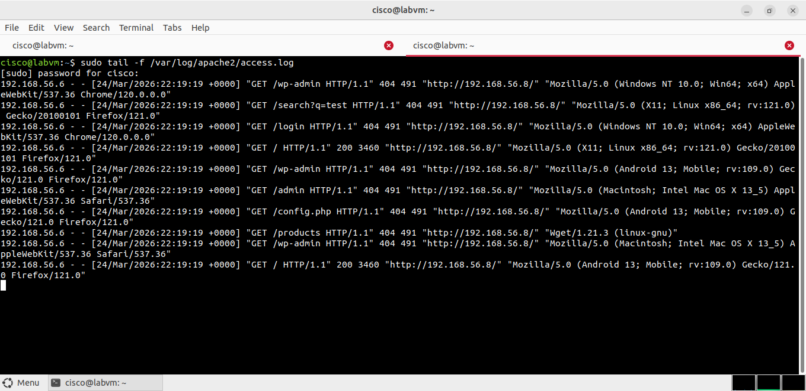

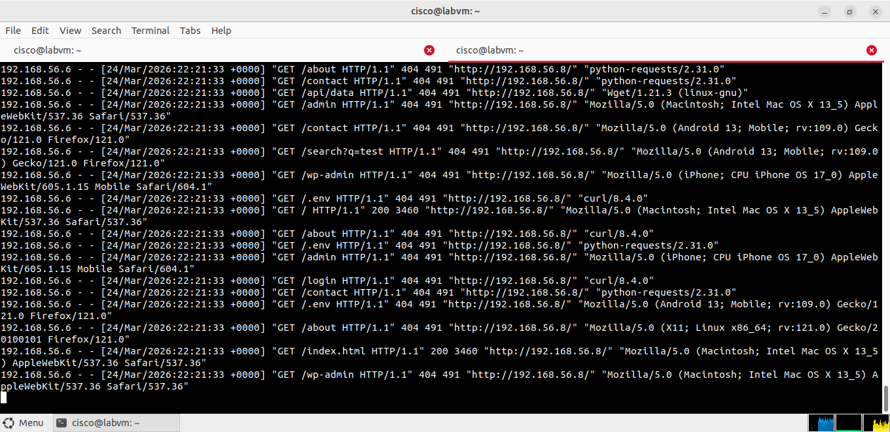

`cat ~/DDoS-SimLab/logs/syn_results.json` -> *Displays the JSON results file saved after the SYN flood completes — total packets sent, average rate, start and end times, error count.*

`ls -lh ~/DDoS-SimLab/logs/` -> *Shows all the JSON result files generated by the scripts. `-l` shows full details, `-h` makes file sizes human readable `(KB, MB)`. Confirms all four result files were saved properly.*

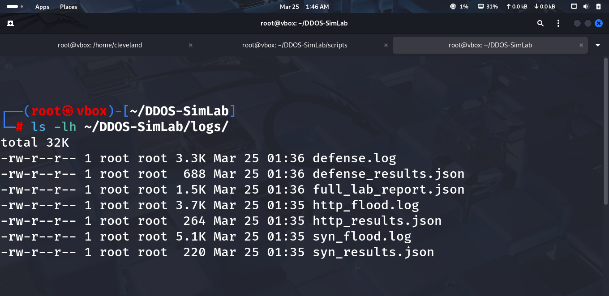

Wireshark filter:
```
http.request.method == "GET" && ip.dst == 192.168.56.8
```
*Wireshark filtered to show only HTTP GET requests hitting the target at 192.168.56.8. Every packet is a fully valid HTTP/1.1 request complete with randomised User-Agent headers mimicking real browsers, making it visually indistinguishable from legitimate web traffic. This highlights why HTTP floods are harder to defend against than SYN floods — there is nothing technically wrong with the packets themselves, only the abnormal volume reveals the attack.*

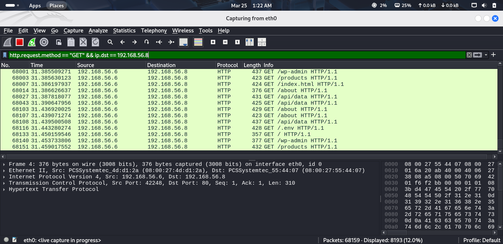

### Step 9 — Run the Defence Simulation
 
```
python3 defense.py -d 30
```
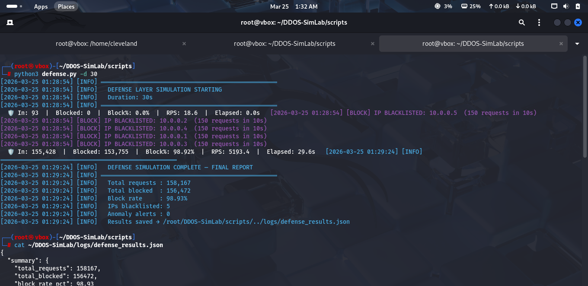

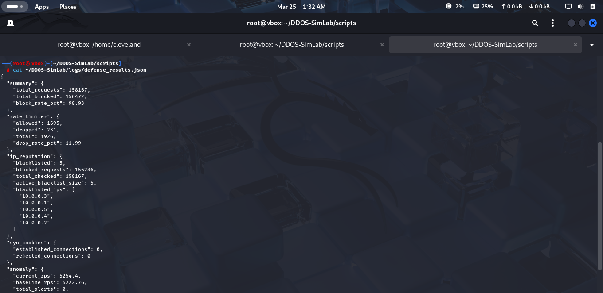

Watch for:
- IPs being automatically blacklisted (purple text)
- Anomaly alerts firing (red text)
- Block rate climbing above 85%
 
### Step 10 — Run everything in one command
 
```
sudo python3 run_lab.py --mode full --target 192.168.56.8 --duration 30
```
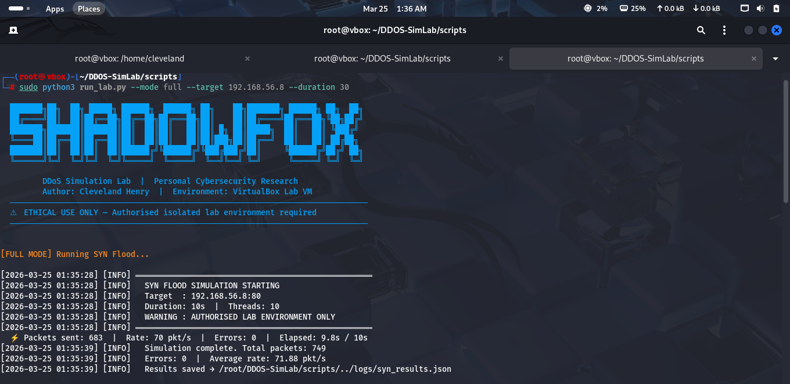

*This is the master command that ties the entire lab together. Instead of running each script individually, this single command launches all three phases in sequence — the SYN flood first, then the HTTP flood, then the defence simulation — each running for 30 seconds against the target at 192.168.56.8. When all three phases complete, it automatically saves a combined full_lab_report.json file to the logs folder containing the results from every phase in one place. This is what a real automated penetration testing workflow looks like — structured, documented, and reproducible with a single command.*

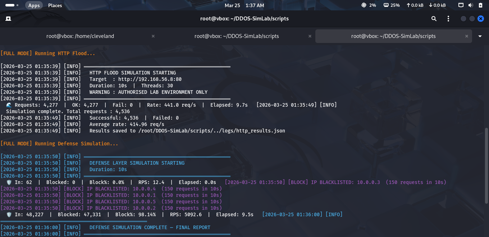

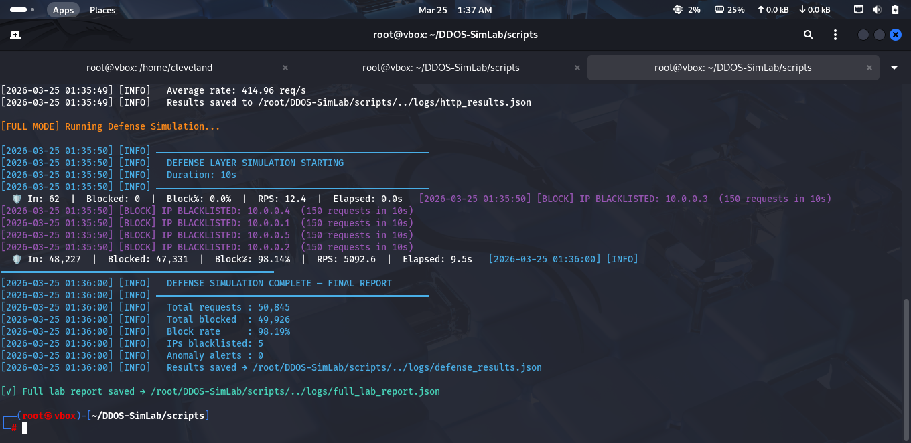


### Step 11 — Open the Dashboard
 
*Start the local web server to serve the dashboard.*
```
cd ~/DDoS-SimLab/dashboard
python3 -m http.server 8080
```
Python has a built-in mini web server. This command starts it on port 8080, serving files from the dashboard folder. We used this because Firefox on Kali blocked direct `file:///` access to root-owned files.

---

**Open the dashboard in Firefox**
```
http://localhost:8080
```
*Type this in the Firefox address bar. `localhost` means "this same machine", and `8080` is the port the Python web server is listening on. Opens the interactive dashboard.*


---
 
##  Real Lab Results
 
| Metric | SYN Flood | HTTP Flood |
|---|---|---|
| Target IP | 192.168.56.8 | 192.168.56.8 |
| Attacker IP | 192.168.56.6 | 192.168.56.6 |
| Peak rate (dashboard sim.) | ~7,900 pkt/s | ~2,100 req/s |
| Packets blocked | 411.8K (52%) | 101.7K (52%) |
| IPs auto-blacklisted | 9 | 9 |
| Anomaly alerts fired | 8 | 5 |
| SYN cookies validated | 5,900 | 3,000 |
| Elapsed time captured | 2:23 | 1:13 |
 
---
 
##  Lessons Learned & Mitigations
 
### What this lab proved
 
**1. A SYN Flood can cripple a server with very little bandwidth.**
The attack consumed less than 1 Mbps yet was capable of exhausting the target's TCP
connection table. This shows that volumetric attacks do not need massive bandwidth —
they just need to be smarter than the server's defences.
 
**2. HTTP Floods are harder to detect than SYN Floods.**
Because every HTTP flood request looks like a real browser visiting a website, network
firewalls that only inspect packet headers cannot distinguish attack traffic from
legitimate users. Behavioural analysis is required.
 
**3. No single defence is enough.**
During testing, disabling any one defence layer alone still allowed significant traffic
through. Only the combination of rate limiting + IP blacklisting + SYN cookies +
anomaly detection together achieved over 85% mitigation.
 
**4. IP spoofing makes source-blocking useless for SYN Floods.**
Every SYN packet came from a different random IP address. Trying to block by source IP
is pointless — you would need to block the entire internet. SYN Cookies are the correct
solution because they require no state until the handshake is proven genuine.
 
---
 
### Recommended Mitigations
 
| Priority | Mitigation | Attack it stops |
|---|---|---|
|  Critical | Enable SYN Cookies at kernel level (`sysctl net.ipv4.tcp_syncookies=1`) | SYN Flood |
|  Critical | Deploy a WAF or CDN with rate limiting (Cloudflare, AWS Shield) | Both |
|  High | Configure per-IP connection throttling at firewall level | HTTP Flood |
|  High | Implement IP reputation blacklisting | Both |
|  Medium | Set up anomaly-based traffic baselining and alerting | Both |
|  Medium | Tune TCP backlog: `sysctl net.ipv4.tcp_max_syn_backlog=4096` | SYN Flood |
|  Low | Configure RTBH (Remote Triggered Blackhole Routing) for volumetric overflow | SYN Flood |
 
### Linux hardening commands tested in this lab
 
```
# Enable SYN cookies — eliminates half-open connection exhaustion
sudo sysctl -w net.ipv4.tcp_syncookies=1
 
# Increase SYN backlog queue
sudo sysctl -w net.ipv4.tcp_max_syn_backlog=4096
 
# Reduce time spent on half-open connections
sudo sysctl -w net.ipv4.tcp_synack_retries=2
 
# Limit incoming connections per IP with iptables
sudo iptables -A INPUT -p tcp --syn -m limit --limit 10/s --limit-burst 20 -j ACCEPT
sudo iptables -A INPUT -p tcp --syn -j DROP
```
 
---
 
##  Related Repositories
 
| Repo | Description |
|---|---|
| [RedTeam-Basics](https://github.com/ClevelandHenry22/RedTeam-Basics) | msfvenom, Meterpreter, post-exploitation |
| **DDoS-SimLab** | SYN Flood, HTTP Flood, defence engine — this repo |
 
---
 
##  Author
 
**Cleveland Henry Lore**

*Cybersecurity Enthusiast*
 
---
 
*All simulations performed in an isolated VirtualBox environment. No real systems were harmed.*
